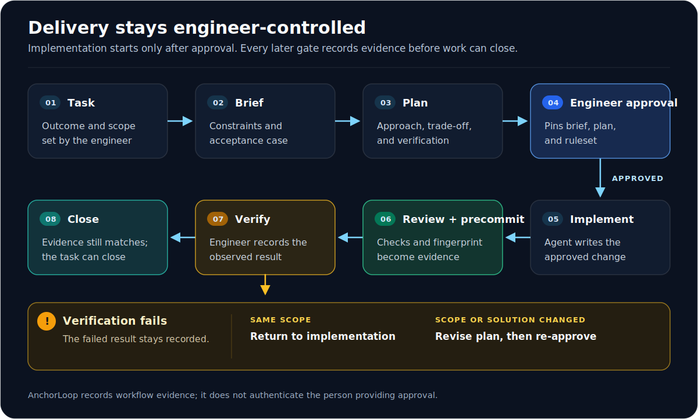
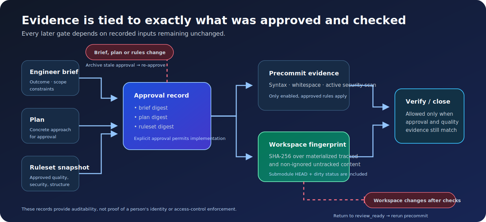

# AnchorLoop

**Engineer-controlled, agent-neutral workflow for AI-assisted software delivery.**

[English](README.md) · [Русский](docs/i18n/README.ru.md) · [Español](docs/i18n/README.es.md) · [Português](docs/i18n/README.pt-BR.md) · [Français](docs/i18n/README.fr.md) · [Deutsch](docs/i18n/README.de.md) · [日本語](docs/i18n/README.ja.md) · [简体中文](docs/i18n/README.zh-CN.md)

AnchorLoop lets an AI agent implement code without taking ownership away from the engineer. The engineer explicitly controls task intent, decisions, project rules, skills, structure changes, and final acceptance.

## Status

**Published production:** `anchorloop@0.1.0`

**Unreleased main:** `0.2.0` release candidate

The published `0.1.0` package remains the production version. The current
release branch contains the unreleased recovery, validation, ownership,
release-safety, and multi-agent installer work planned for `0.2.0`. Until the
signed `v0.2.0` tag passes staging, maintainer approval, exact-version registry
smoke, and interactive `latest` promotion, do not describe those additions as
available from npm `latest`.

## Core idea

> The agent may write the code. The engineer owns why it exists, what trade-off was made, which rules apply, and how the result is verified.

AnchorLoop does not measure human-written lines. It focuses on the work that preserves engineering ownership:

- writing the task outcome and constraints;
- approving the plan before implementation;
- approving new quality, security, and structure rules;
- selecting skills and external solutions;
- checking the delivered behaviour;
- learning when a concept or decision is unclear.

Every plan runs in a recorded ownership mode. `AUTO` selects `FAST` for
low-risk documentation/chore work, `STANDARD` for ordinary delivery, and
`CAREFUL` for sensitive work such as authentication, payments, migrations,
concurrency, infrastructure, destructive changes, public APIs, or new
dependencies. STANDARD and CAREFUL require an engineer-created artifact,
trade-off reasoning, a verification strategy, and a comprehension statement;
CAREFUL schedules delayed recall **24 hours after close**. An explicit
downgrade is visible in the task record and requires a reason.

## Delivery loop

AnchorLoop records the delivery loop: implementation follows an engineer-approved
plan, and a failed verification returns through an explicit revision rather than
silently reopening work.

## Trust boundary

AnchorLoop records an auditable workflow gate; it is not authentication or
access control by itself. A coding agent with access to the same terminal can
invoke CLI commands and supply a name. Approval records therefore include
provenance:

- `audit` records who says they approved an action;
- `interactive-tty` requires an interactive terminal and an explicit typed
  `APPROVE` confirmation;
- a trusted host adapter or separate approval channel remains future work.

Do not treat `--by` or a terminal confirmation as proof of a human identity
without such a trusted approval channel. The portable skill reinforces this
rule but does not replace the CLI or `.anchor/` state.

## Agent-neutral by design

The source of truth is the local `anchor` CLI and the project’s `.anchor/` directory—not a particular model, provider, IDE, or slash-command format.

| Host capability | How AnchorLoop works |
|---|---|
| Terminal access | Run the `anchor` CLI directly. |
| Instructions or skills | A host adapter can read the current state and display the next allowed action. |
| Native commands, hooks, or MCP | An adapter can make the workflow more convenient or add guardrails. |
| No terminal integration | The engineer or a local bridge runs the CLI; the agent reads the generated next action. |

Every host gets the same task states and approval rules. Native integrations must remain thin adapters; they never own the workflow state.

## What is implemented in the unreleased 0.2.0 candidate

- `anchor install` and `anchor uninstall` preview then manage a packaged,
  project- or user-scoped skill adapter for Agent Skills, Codex, Cursor,
  Gemini CLI, Claude Code, and OpenCode destinations. They never modify the
  `.anchor/` workflow state.
- Anchor-managed state and skill destinations reject symlink and Windows reparse-point components. Writes use unique temporary files plus atomic replacement; `--force` never bypasses that boundary.
- Project mutations are serialized by a cross-platform lock. State and ordered
  events commit through a durable redo journal, interrupted commands recover
  idempotently, and read commands refuse to expose a partial transaction.
- Skill install, update, and uninstall use a separate durable journal. A retry
  finishes an interrupted operation rather than leaving an unowned partial
  skill directory.
- `anchor doctor` is inspect-only, `doctor --strict` turns findings into a
  failing health check, and `doctor --repair` explicitly recovers an interrupted
  transaction or torn final event-log entry.
- Failed verification is preserved and can explicitly return to implementation or planning with `anchor revise`; it no longer strands the active task.
- The quality gate records deterministic workspace and Git-snapshot fingerprints. Verification and close are blocked when checked content, `HEAD`, or index state changes afterward.
- Before `review_ready` and again before `precommit`, AnchorLoop evaluates
  changes from the task baseline: the actual Git diff when a committed `HEAD`
  exists, or a deterministic materialized-file fallback in unborn and non-Git
  workspaces. CAREFUL paths block a lower-mode task until the engineer revises
  the plan or records a path-specific reviewed override.
- `anchor init` and `anchor add` preview project setup and require `--apply` before creating files.
- Setup creates portable `.anchor/` state, baseline **proposed** rules, Graphify integration metadata, a portable agent protocol, and a generated next-action file.
- The task flow enforces `start → brief → plan → approve → implement → review → precommit → verify → close`.
- Code cannot move to `implement` until the complete engineer brief, plan summary, named approval, and task ruleset snapshot are recorded. If any pinned artifact changes afterward, the stale approval is archived and the task must be approved again.
- Rules are proposals until an engineer runs `anchor rules approve <id> --by <engineer>`. Replacing an active rule requires an explicit `anchor rules supersede` record; legacy approved rules must be migrated through that explicit path.
- `anchor precommit` always runs Python syntax and Git whitespace checks; a simple secret/key scan runs only when the task's engineer-approved security rule is active.
- `anchor agent detect` and `anchor agent status` are read-only; `anchor agent setup portable` previews then records the portable adapter.

Graphify installation, full language-specific security tooling, project-specific test commands, external research, skill discovery, and native host adapters are planned next. AnchorLoop never installs them silently.

## Install the published 0.1.0 package

Requirements: Node.js 18 or newer and Python 3.11 or newer.

Use the exact published production version:

~~~sh
npx --yes anchorloop@0.1.0 install --project --platform codex --apply
~~~

Do not use an unversioned `npx anchorloop install` command to test the features
documented below: npm `latest` continues to resolve to `0.1.0` until the
`0.2.0` release flow completes.

## Unreleased 0.2.0 guided setup

From a development checkout, install the current Python CLI in editable mode:

~~~sh
python -m pip install -e .
anchor install --interactive
~~~

The compact setup wizard asks where AnchorLoop should live:

- **This project** installs the portable Agent Skills standard at
  `.agents/skills/anchorloop/` for compatible agents in the repository.
- **My profile** lets you choose **Codex**, **Cursor**, **Gemini CLI**,
  **Claude Code**, **OpenCode**, the shared **Agent Skills standard**, or
  **all native agents** at once. The shared standard remains separate so a host
  never discovers the same skill twice.

The wizard shows every destination and asks for confirmation before writing.
It installs only the thin skill adapter with a pinned
`npx --yes anchorloop@<version>` runner. It never creates `.anchor/`, modifies
application code, adds `node_modules`, or stores a cache in the project.

The six destination layouts are covered by filesystem tests. Native host
discovery remains **Experimental** until each real host is opened and confirms
that it discovers and follows the installed skill; file placement alone is not
a production host-discovery claim.

For local dogfooding, scripts, and CI, use explicit flags instead of the
wizard. Do not commit the generated installation:

~~~sh
anchor install --project --platform codex --apply
anchor install --global --platform gemini --apply
anchor install --global --all --apply
anchor install --global --all
~~~

npm may keep its own user-level download cache; AnchorLoop never writes an npm
cache, Python bytecode cache, or workflow cache into the project, and those
project-local paths are ignored by Git.

## Install the standalone command-line tool

Requirements: Python 3.11 or newer. To install the current project directly
from its Git repository, without cloning a development checkout:

~~~sh
pipx install git+https://github.com/ppmarkek/AnchorLoop.git
~~~

If you do not use `pipx`, install it into the active Python environment:

~~~sh
python -m pip install "git+https://github.com/ppmarkek/AnchorLoop.git"
~~~

This is a Git installation path, not a PyPI release. Afterward, run `anchor
install ...` to add the optional portable skill adapter to a project or user
skill directory.

## Migrating from 0.1.0 to 0.2.0

Do not delete `.anchor/`: it is the project workflow record. The `0.2.0`
migration refreshes managed protocol/support files and skill assets while
preserving task, rule, approval, and audit records. If an installed skill was
edited locally, review and preserve that diff before using `--force`.

See the [0.1.0 to 0.2.0 migration guide](docs/MIGRATION_0.2.md) for the required
`0.1.0` recovery preflight, release-candidate procedure, and exact commands to
use after publication.

## Development from a checkout

Requirements: Python 3.11 or newer.

~~~sh
git clone https://github.com/ppmarkek/AnchorLoop.git
cd AnchorLoop
python3 -m venv .venv
source .venv/bin/activate
python3 -m pip install -e .
~~~

On Windows, activate the virtual environment with:

~~~powershell
.venv\Scripts\Activate.ps1
~~~

## Install the portable skill adapter from the standalone CLI

The CLI remains a standalone, agent-neutral product. Its optional skill package
only tells compatible agents how to consult the CLI and current Anchor state.
It does not replace the workflow engine or make AnchorLoop Codex-only.

After installing the CLI, preview then install the generic project skill. This
route keeps `anchor` as the command runner; the npm shortcut above instead
renders a pinned npx runner for hosts where the Python CLI is not persistently
installed.

~~~powershell
anchor install --project --platform agents
anchor install --project --platform agents --apply
~~~

This writes only `.agents/skills/anchorloop/`, which is the cross-framework
Agent Skills location. Codex is an explicit, optional target:

~~~powershell
anchor install --project --platform codex --apply
~~~

The installer copies packaged Markdown and an ownership marker. It does not
modify `.anchor/`, application code, `AGENTS.md`, host hooks, or Graphify
configuration. It refuses to overwrite or remove locally modified skill assets
until the engineer explicitly uses `--force`. Remove only unchanged,
installer-owned files with:

~~~powershell
anchor uninstall --project --platform agents --apply
~~~

## First project

From the repository you want to control:

~~~sh
anchor add
anchor add --apply
anchor rules list
anchor rules approve baseline-code-quality-v1 --by "Ada Engineer"
anchor rules approve baseline-security-v1 --by "Ada Engineer"
anchor rules approve baseline-structure-v1 --by "Ada Engineer"
anchor start "Retry temporary webhook failures"
anchor brief --by "Ada Engineer" --outcome "Retry temporary failures" --scope "Webhook delivery only" --constraints "Keep the API compatible" --invariant "A transient failure retries safely" --uncertainty "Provider retry limits"
~~~

The first command only prints the setup plan, including the managed entries it
will append to the root and `.anchor` Git ignore files. The second creates
state. Nothing is installed, indexed, committed, or changed in application
source code without an explicit command.

After starting a task, AnchorLoop asks the engineer for:

~~~text
Outcome:
Scope / non-goals:
Constraints:
Invariant or acceptance case:
Main uncertainty:
~~~

Then progress deliberately. The human artifact and comprehension text below
must come from the engineer; an agent must not manufacture them:

~~~sh
anchor plan --summary "Use bounded exponential backoff and preserve delivery idempotency." --mode AUTO --task-type feature --approach "Retry only transient responses with a bounded idempotent schedule." --alternative "Immediate unlimited retries were rejected because they amplify outages." --risk "A retry can duplicate delivery." --verification "Exercise a transient failure and assert one final delivery." --human-artifact "Ada's acceptance case: two transient failures then one successful delivery with the same id." --comprehension "Prediction: the idempotency key prevents duplicate side effects across attempts." --by "Ada Engineer"
anchor approve --by "Ada Engineer"
anchor implement
anchor review
anchor precommit
anchor verify --by "Ada Engineer" --result pass --reason "The documented manual scenario passed." --recall "The bounded schedule controls load; the stable key controls duplicate effects."
anchor close
~~~

For a CAREFUL task, add `--rollback-mitigation` to the plan. At close,
AnchorLoop derives `recall_due_at` as **24 hours after the close timestamp**;
once due, the engineer can record delayed recall with `anchor recall --task
<id> --by "Ada Engineer" --response "..." --score 0..5`.

If manual verification fails, preserve that evidence and return through an
explicit revision rather than abandoning the active task:

~~~sh
anchor verify --by "Ada Engineer" --result fail --reason "The retry still loses the delivery id." --recall "The key is regenerated on each attempt, so the invariant does not hold."
anchor revise --target implement --reason "Fix the observed behavior within the approved scope."
~~~

Use `--target plan` when the solution or scope decision must change; then
record a revised plan and approval before implementation resumes.

## Rules belong to the engineer

AnchorLoop proposes baseline rules for code quality, security, and project structure. They are inactive until approved. A rule has an ID, exact wording, category, source, rationale, version, and approval event.

~~~sh
anchor rules list
anchor rules propose structure "Features may import only public module entry points."
anchor rules approve rule-structure-<id> --by "Ada Engineer"
~~~

The active ruleset is pinned to a task when its plan is approved. An agent can propose a new rule but cannot activate, revise, retire, or silently bypass one.

## Pre-commit baseline

Before verification, run:

~~~sh
anchor precommit
~~~

The current baseline blocks:

- invalid Python syntax;
- likely hard-coded credentials or private keys in supported text files, when the task's approved security rule enables that check;
- whitespace errors reported by `git diff --check` and `git diff --cached --check`.

It also records that project-specific formatter, linter, type-checker, test-runner, dependency scanner, and framework security profile still need explicit configuration. This command never creates a Git commit.

Each successful run stores a SHA-256 fingerprint of the materialized tracked
and non-ignored untracked files. Git HEAD, index, and diff state are recorded
as integrity evidence too, so a commit or staging transition requires the gate
to be rerun even when worktree bytes are restored. A submodule's checked-out
materialized files are fingerprinted recursively, including nested dirty and
non-ignored untracked content. An uninitialized submodule is bound to its
tracked gitlink. If checked content or authoritative Git state changes before verification or close,
AnchorLoop returns the task to review and requires a new pre-commit run.

Fingerprint entries are length-framed and store a per-file content digest; a
symlink is recorded as a link target rather than read through to an external
file.

### Evidence that expires when reality changes

AnchorLoop records evidence, not identity: a changed approved artifact archives
the approval, while changed checked code requires review and pre-commit again.
Verification can also record reported agent turns, input/output tokens, active
minutes, and a provider/model pair. Together with task mode/type, wall time,
and recall score, these fields make a model-by-mode pilot exportable from the
closed task JSON without turning estimates into trusted telemetry.

After an engineer observes production follow-up, `anchor outcome` records the
latest defect count and whether rollback or corrective refactoring was needed.
`anchor report --format json|csv` aggregates closed tasks locally for a
model-by-mode pilot; it performs no network upload.

DRY, KISS, YAGNI, SOLID, clean-code, and structural checks are evidence-based policies: a finding must point to a concrete location, explain the likely cost, and propose a proportionate alternative. AnchorLoop must not turn those principles into generic style policing.

## Project state

~~~text
.anchor/
  config.json
  next-action.md
  protocol/                 portable workflow contract
  tasks/                    active and closed task records
  rules/                    proposals, approved versions, active rules
  architecture/             structure proposals and policy
  graphify/                 integration metadata
  agents/                   detected capabilities and adapter manifests
  project.lock              ignored cross-process lock metadata
  transactions/ and outbox/ ignored recovery journals and delivery state
  cache/ and logs/          ignored local artefacts
~~~

The files are deliberately readable. The CLI validates changes but does not hide decisions in a remote service or model memory.
Transaction receipts are bounded to the latest 128 successful operations;
event IDs remain conflict-checked against the durable event log. After
upgrading an existing project, rerun `anchor add --apply` (or the equivalent
pinned npx command) to append missing cache and recovery entries to the project
`.gitignore` and `.anchor/.gitignore` while preserving custom lines. Git does
not automatically untrack a file that was already committed, so inspect the
index separately during that migration.

## Documentation

- [Product plan](docs/PROJECT_PLAN.md)
- [Decision map](docs/ANCHOR_DECISION_MAP.md)
- [Domain glossary](CONTEXT.md)
- [Portable skill adapter](docs/PORTABLE_SKILL.md)
- [Migration from 0.1.0 to 0.2.0](docs/MIGRATION_0.2.md)
- [Changelog](CHANGELOG.md)
- [Contributing](CONTRIBUTING.md)
- [Security policy](SECURITY.md)

## Development

Run the test suite without installing the package:

~~~sh
PYTHONPATH=src python3 -m unittest discover -s tests
~~~

Or install the project in editable mode and use:

~~~sh
python3 -m unittest discover -s tests
anchor help
~~~

Validate the npm launcher and publishable package contents with Node.js 18 or
newer:

~~~sh
npm run test:npm
npm run pack:check
~~~

## License

MIT. See [LICENSE](LICENSE).
